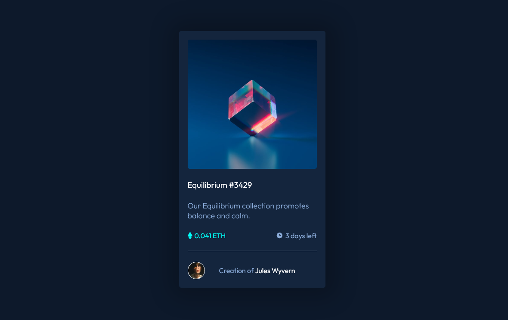

# Frontend Mentor - NFT preview card component solution

This is a solution to the [NFT preview card component challenge on Frontend Mentor](https://www.frontendmentor.io/challenges/nft-preview-card-component-SbdUL_w0U). Frontend Mentor challenges help you improve your coding skills by building realistic projects.

## Table of contents

- [Frontend Mentor - NFT preview card component solution](#frontend-mentor---nft-preview-card-component-solution)
  - [Table of contents](#table-of-contents)
  - [Overview](#overview)
    - [The challenge](#the-challenge)
    - [Screenshot](#screenshot)
    - [Links](#links)
  - [My process](#my-process)
    - [Built with](#built-with)
    - [What I learne](#what-i-learne)
  - [Author](#author)

**Note: Delete this note and update the table of contents based on what sections you keep.**

## Overview

### The challenge

Users should be able to:

- View the optimal layout depending on their device's screen size
- See hover states for interactive elements

### Screenshot



### Links

- Solution URL: [Add solution URL here](https://your-solution-url.com)
- Live Site URL: [Add live site URL here](https://your-live-site-url.com)

## My process

### Built with

- Semantic HTML5 markup
- CSS custom properties
- Flexbox

### What I learne

I learnt how to organise and structure css code. Also I learnt the use of variables and horizontal and vertical centering using flexbox.

```html
<div class="card">
  <div class="card_img">
    <div class="img_hover">
      
    </div>
    
  </div>
  <div class="card_content">
    <h3 class="card_title">Equilibrium #3429</h3>
    <p class="card_desc">
      Our Equilibrium collection promotes balance and calm.
    </p>
    <div class="card_cta">
      <p class="card_price">
        
        0.041 ETH
      </p>
      <p class="card_time">
         3
        days left
      </p>
    </div>
    <div class="line"></div>
    <div class="card_credits">
      
      <p class="credit">Creation of <span class="name">Jules Wyvern</span></p>
    </div>
  </div>
</div>
```

```css
.img_hover {
  position: absolute;
  width: inherit;
  height: inherit;
  background-color: rgba(0, 255, 247, 0.5);
  background-blend-mode: hard-light;
  justify-content: center;
  align-items: center;
  display: none;
  border-radius: 5px;
}
```

## Author

- Website - [Shashank Bhat](https://shashankbhat.co.in/)
- Frontend Mentor - [@shashankbhat2](https://www.frontendmentor.io/profile/shashankbhat2)
